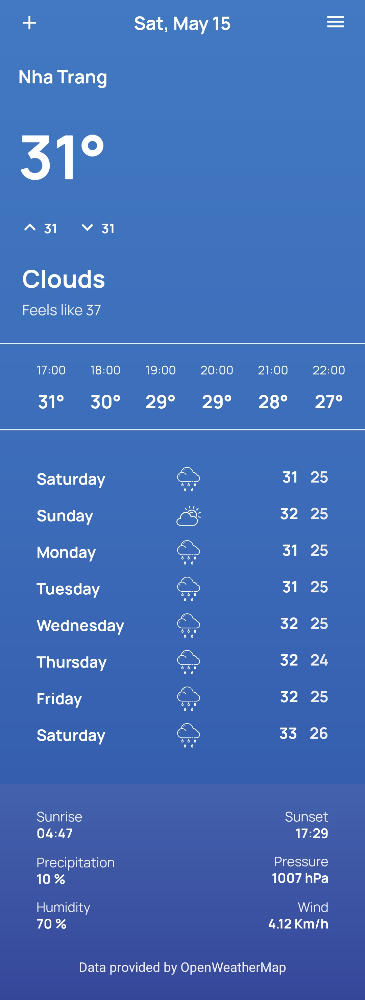
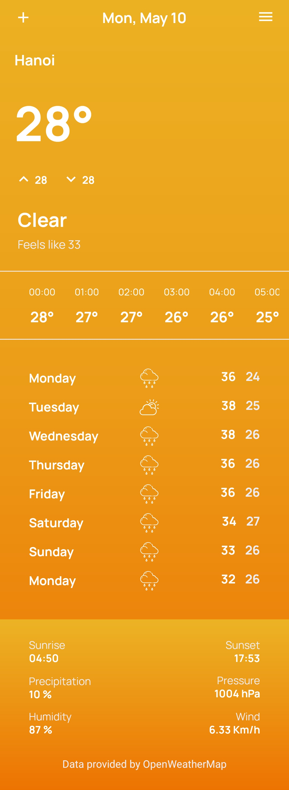
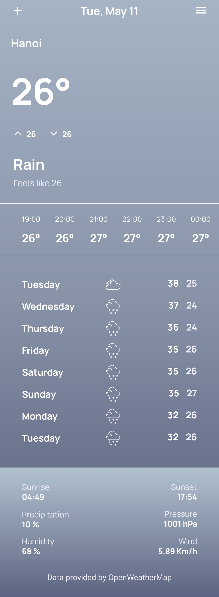
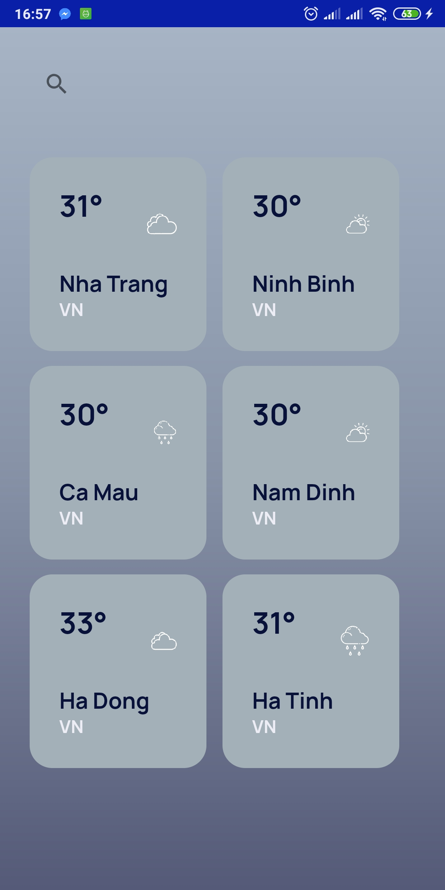

# Weather_Forecast
Demo: <a href="https://youtu.be/4SDlc_k94dU"> Demo Video</a>
* This is a native app based on Kotlin and use the OpenWeatherMap API to pick up data from their server.
Including:
- Kotlin
- Coroutine
- Retrofit + Gson
- MVVM Structure
- LiveData

## Author
Facebook: [HiuTrun](https://www.facebook.com/hiutrun0x0/)  
Instagram: [HiuTrun](https://www.instagram.com/hiutrun0x0/)  

## Below is several screens captured in this app.

